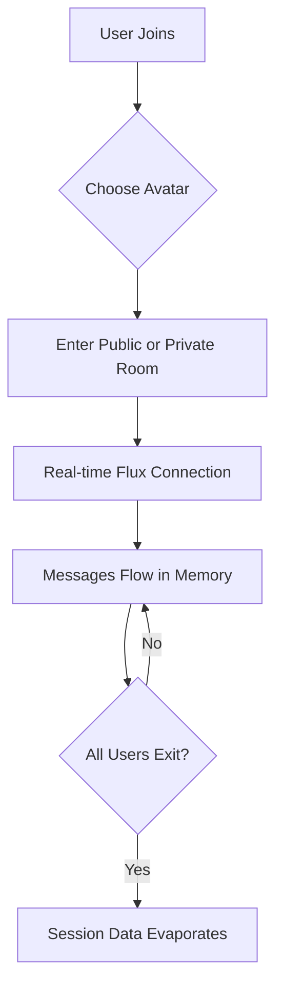

# FluxChat – Real-Time Message Flow

<p align="center">
  
  
  
  
</p>

**FluxChat** is a high-performance, real-time web application designed for seamless, fluid communication. The name represents the "flow" and transience of messaging—where conversations move quickly, naturally, and disappear when no longer needed.

---

## Why FluxChat?

In a world of permanent logs, **FluxChat** offers a breath of fresh air. Built for **privacy and speed**, it operates without a persistent database. 

- **🔏 Database-Free**: Your conversations live only in memory. Once the room is empty, all messages evaporate.
- **⚡ Real-Time Flux**: Built on WebSockets for instantaneous, low-latency messaging.
- **🎨 Premium UI**: A modern, iOS-inspired aesthetic with smooth animations and a responsive mobile layout.

---

## Key Features

- **🖼️ Advanced Photo Sharing**: Send high-quality images with a professional WhatsApp-style flow.
  - **Live Preview**: See your image before sending.
  - **Captions**: Add a message or caption directly to your photos.
  - **Manual Send**: Full control over when your media is shared.
- **✨ Professional Image Viewer**: A high-end modal for viewing shared photos.
  - **Glassmorphism Backdrop**: Beautifully blurred background for focused viewing.
  - **Snap-Fast Animations**: Optimized transitions for an "instant" feel.
  - **Easy Controls**: One-click download and multiple ways to close (Click outside, 'X' button, or 'Esc').
- **🛡️ Auto-Evaporate Security**: All custom room data and messages are wiped clean as soon as the last user leaves. No history, no logs, total privacy.
- **👤 Persistent Avatars**: Select from a curated set of 2 male and 2 female avatars that follow you throughout your session.
- **🌍 Tech Lounges**: Dive into 6 permanent professional rooms: `#cse`, `#tech`, `#coding`, `#ai`, `#webdev`, and `#placements`.
- **🔑 Private Channels**: Create encrypted-by-nature private rooms locked with unique 4-digit codes.
- **💎 Premium Design**: Custom professional blue scrollbar, sleekrounded containers, and perfectly aligned UI elements for a top-tier user experience.

---

## Tech Stack

- **Frontend**: [Next.js](https://nextjs.org/) (React) + [Tailwind CSS](https://tailwindcss.com/)
- **Backend**: [Node.js](https://nodejs.org/) + Express
- **Real-Time**: [Socket.IO](https://socket.io/)
- **Avatars**: [DiceBear Avataaars](https://api.dicebear.com/)
- **Icons**: [Lucide React](https://lucide.dev/)

---

## How It Works (The "Flux" Logic)



---

## Getting Started (Local Development)

### 1. Prerequisites
Make sure you have [Node.js](https://nodejs.org/) and `npm` installed.

### 2. Installation
```bash
git clone https://github.com/hitendra-3/FluxChat.git
cd FluxChat
npm install
```

### 3. Running Locally
FluxChat requires two processes to run at once. Open two terminal windows:

**Terminal 1 (Socket Backend):**
```bash
node server.js
```

**Terminal 2 (Frontend Interface):**
```bash
npm run dev
```

Open your browser at `http://localhost:3000` and start the flow!

---

## Deployment

Since FluxChat uses long-lived WebSockets, it performs best on platforms with persistent process support.

- **Recommended**: [Railway.app](https://railway.app/) or [Render.com](https://render.com/).
- **Scaling**: For high traffic, you can deploy the `server.js` and the Next.js frontend as separate, linked services.
- **Config**: Ensure `NODE_ENV` is set to `production` and provide a `PORT` environment variable for the socket server.

---

<p align="center">
  Built with ❤️ for real-time enthusiasts.
</p>
