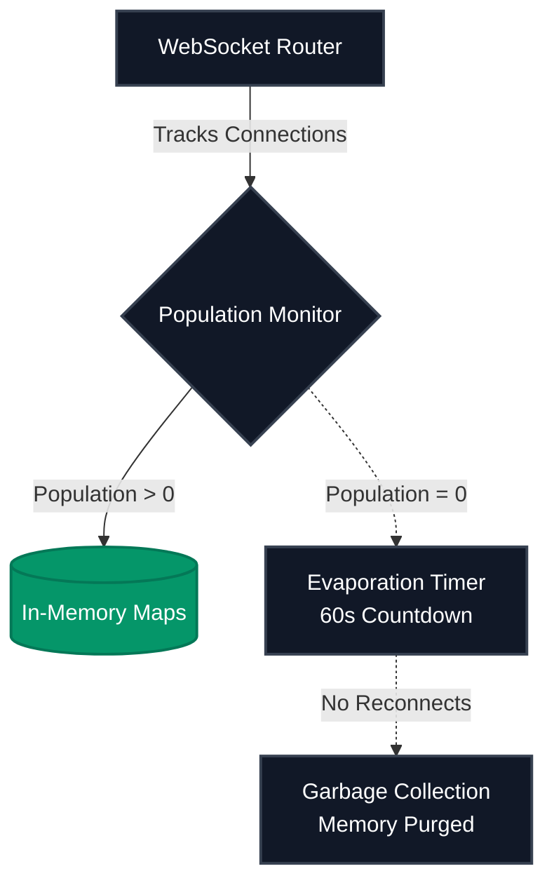

# 🏛️ FluxChat: Architecture & Design Protocol

> "In the noise of modern communication, FluxChat is the signal of absolute clarity."

FluxChat is a high-performance communication ecosystem. Unlike traditional chat applications that focus on feature bloat, FluxChat was architected from the ground up as a study in **backend state management** and **minimalist design psychology**. 

This document outlines the core engineering decisions and design philosophies driving the platform.

---

## ⚙️ Backend Architecture: The Memory Ecosystem

The backend of FluxChat was designed to solve a specific problem: **How do we maintain lightning-fast chat history without hammering a database on every single keystroke?**

### 1. Stateful Memory Design
Instead of performing costly read/write operations to a PostgreSQL database for every message, the server operates as a **Stateful Node.js Ecosystem**. 
- Active sectors (chat rooms) live entirely within high-speed RAM.
- WebSocket events (`Socket.io`) handle bi-directional data flow, acting as the nervous system of the application.
- This decoupling of live chat from persistent storage results in zero-latency messaging.

### 2. The "Global Pulse" Garbage Collection
A purely in-memory architecture risks fatal memory leaks if data is never cleared. To solve this, I engineered the **Global Pulse** mechanism:
- The server tracks the total population of connected sockets.
- As long as *one user* is online anywhere in the platform, the server assumes the ecosystem is "active" and preserves all memory maps.
- When the population hits exactly zero, the server initiates a `60-second _evaporationTimer`. If no one reconnects, the garbage collector safely purges the memory, returning the server to a zero-state.

### 3. Absolute Signal Isolation
To prevent cross-channel data bleeding, all Room IDs are forcefully normalized as `Strings` at the socket connection layer. When a user shifts sectors, they are explicitly decoupled from their previous room stream before binding to the new one, ensuring cryptographic-level separation of chat traffic.

---

## 💎 Design Philosophy: Prism-Light UX

As the sole designer of the platform, my goal was to create an interface that feels like high-end enterprise software (e.g., Linear, Stripe) rather than a consumer social app.

### 1. The "Prism-Light" Methodology
While dark mode is trendy, true executive-grade software often relies on stark, high-contrast light environments to promote focus.
- **Pearl-Glass UI**: The interface uses subtle backdrop blurs, 1px precision borders, and extremely soft elevation shadows to create depth without visual noise.
- **Spatial Architecture**: The layout strictly adheres to an 8px grid system. Sidebars seamlessly collapse into off-canvas drawers on mobile to preserve the golden ratio of the reading area.

### 2. Zero-Bloat UX
I intentionally decommissioned media uploads (images, files) from the platform. By restricting the input exclusively to text, the UI naturally enforces concise, high-signal communication. The typography (using mathematical spacing) becomes the primary visual element, rather than a container for random media.

### 3. The Psychology of "Zero-Reset" Security
The authentication system relies on Supabase JWTs, but the *experience* of the security is purely psychological. 

> [!CAUTION]  
> **"Tattoo your password on your soul, because we don't believe in 'Reset' buttons. In FluxChat, you either remember the key, or you lose the vault forever."** 

This isn't just a funny quote; it is a deliberate UX decision. By removing the "Forgot Password" safety net, we eliminate administrative bloat and force the user to treat their credentials with absolute respect.

---

## 🛠️ Technical Stack

- **Architecture/Backend**: Node.js, Socket.io (Stateful Memory routing)
- **Frontend/Design**: Next.js 14, Tailwind CSS (Custom Prism-Light design system)
- **Database/Auth**: Supabase (PostgreSQL / JWT Security layer)

---

## 🤝 Authorship

**Architected, Designed, and Engineered exclusively by:**
- **Hitendra S**

---

  <i>FluxChat v2 — Built for speed. Designed for professionals.</i>

